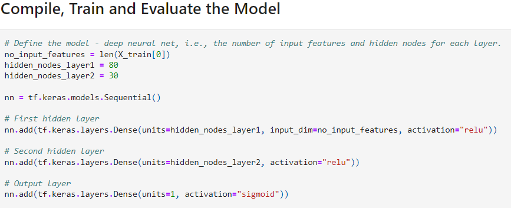

0. 
no_input_features = len(X_train[0])
hidden_nodes_layer1 = 80
hidden_nodes_layer2 = 30

Epoch 100/100
804/804 [==============================] - 2s 2ms/step - loss: 0.5336 - accuracy: 0.7416

268/268 - 0s - loss: 0.5775 - accuracy: 0.7224 - 462ms/epoch - 2ms/step
Loss: 0.5774813890457153, Accuracy: 0.722449004650116

1. 
no_input_features = len(X_train[0])
# Added 20 more nodes to the first hidden layer
hidden_nodes_layer1 = 100
# Added 30 more nodes to the second hidden layer
hidden_nodes_layer2 = 60

Epoch 100/100
804/804 [==============================] - 1s 1ms/step - loss: 0.5326 - accuracy: 0.7425

268/268 - 0s - loss: 0.6454 - accuracy: 0.7236 - 353ms/epoch - 1ms/step
Loss: 0.6454441547393799, Accuracy: 0.7236151695251465

2.
no_input_features = len(X_train[0])
# Added 20 more nodes to the first hidden layer
hidden_nodes_layer1 = 100
# Added 30 more nodes to the second hidden layer
hidden_nodes_layer2 = 60
# Added a third hidden layer
hidden_nodes_layer3 = 40

Epoch 100/100
804/804 [==============================] - 1s 2ms/step - loss: 0.5309 - accuracy: 0.7428

268/268 - 0s - loss: 0.6112 - accuracy: 0.7231 - 351ms/epoch - 1ms/step
Loss: 0.6112121939659119, Accuracy: 0.7231487035751343

3.
no_input_features = len(X_train[0])
# Added 20 more nodes to the first hidden layer
hidden_nodes_layer1 = 100
# Added 30 more nodes to the second hidden layer
hidden_nodes_layer2 = 60
# Added a third hidden layer
hidden_nodes_layer3 = 40
# Added a forth hidden layer
hidden_nodes_layer4 = 40

# Increased epochs to 200
Epoch 200/200
804/804 [==============================] - 1s 2ms/step - loss: 0.5286 - accuracy: 0.7437

268/268 - 0s - loss: 0.6112 - accuracy: 0.7231 - 351ms/epoch - 1ms/step
Loss: 0.6112121939659119, Accuracy: 0.7231487035751343

# Module 21 Report

## Overview of the Analysis

* The purpose of this challenge is to use deep learning and neural networks to build a model that can create a binary classifier and predict whether applicants will be successful if funded by Alphabet Soup.

* The metadata about each applicant provided by the dataset includes the following:
    * EIN and NAME: Identification columns
    * APPLICATION_TYPE: Alphabet Soup application type
    * AFFILIATION: Affiliated sector of industry
    * CLASSIFICATION: Government organization classification
    * USE_CASE: Use case for funding
    * ORGANIZATION: Organization type
    * STATUS: Active status
    * INCOME_AMT: Income classification
    * SPECIAL_CONSIDERATIONS: Special considerations for application
    * ASK_AMT: Funding amount requested
    * IS_SUCCESSFUL: Denotes if the money used effectively

## Results

### Data Preprocessing
* What variable(s) are the target(s) for your model?
    The target variable used is the "IS_SUCCESSFUL" feature.
* What variable(s) are the features for your model?
    The input variables are all features except "EIN","NAME". 
* What variable(s) should be r
emoved from the input data because they are neither targets nor features?
    "EIN" and "NAME".

#### Compiling, Training, and Evaluating the Model
* How many neurons, layers, and activation functions did you select for your neural network model, and why?
    
    

    * From the image above, the model has 80 neurons for the first layer, 30 neurons for the second layer, 2 layers, relu activation fuction for the hidden layers and sigmoid function for the output layer.

* Were you able to achieve the target model performance?
* What steps did you take in your attempts to increase model performance?

3. Summary: Summarize the overall results of the deep learning model. 

4. Include a recommendation for how a different model could solve this classification problem, and then explain your recommendation.