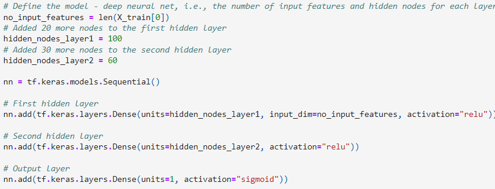

# Module 21 Challenge Report

## Overview of the Analysis

* The purpose of this challenge is to use deep learning and neural networks to build a model that can create a binary classifier and predict whether applicants will be successful if funded by Alphabet Soup.

* The metadata about each applicant provided by the dataset includes the following:
    * EIN and NAME: Identification columns
    * APPLICATION_TYPE: Alphabet Soup application type
    * AFFILIATION: Affiliated sector of industry
    * CLASSIFICATION: Government organization classification
    * USE_CASE: Use case for funding
    * ORGANIZATION: Organization type
    * STATUS: Active status
    * INCOME_AMT: Income classification
    * SPECIAL_CONSIDERATIONS: Special considerations for application
    * ASK_AMT: Funding amount requested
    * IS_SUCCESSFUL: Denotes if the money used effectively

## Results

### Data Preprocessing
* What variable(s) are the target(s) for your model?
    * The target variable used is the "IS_SUCCESSFUL" feature.
* What variable(s) are the features for your model?
    * The input variables are all features except "EIN","NAME". 
* What variable(s) should be r
emoved from the input data because they are neither targets nor features?
    * "EIN" and "NAME".

#### Compiling, Training, and Evaluating the Model
* How many neurons, layers, and activation functions did you select for your neural network model, and why?
    
    

    * From the image above, the model has 2 layers, 80 neurons for the first layer, 30 neurons for the second layer, relu activation fuction for the hidden layers and sigmoid function for the output layer. These hyperparameters were chosen for to get maximum model perfomance.

* Were you able to achieve the target model performance?
    
    

    * No the model did not achieve target performance of 75% as seen in the image above.

* What steps did you take in your attempts to increase model performance?

    

    * 20 more neurons were added to the first layer and 30 more neurons were added to the second layer as seen in the image above.

    

    * 20 more neurons were added to the first layer, 30 more neurons were added to the second layer and new addition of a third layer with 40 neurons as seen in the image above.

    

    * 20 more neurons were added to the first layer, 30 more neurons were added to the second layer, a third layer with 40 neurons, and new addition of a fourth layer with 40 neurons as seen in the image above.

## Summary

* The accuracy of the model is 72.2% and the loss is 57.7% as seen above.

* The accuracy of the first optimized model is 72.4% and the loss is 64.5% as seen above.

* The accuracy of the second optimized model is 72.3% and the loss is 61.1% as seen above.

* The accuracy of the third optimized model is 72.3% and the loss is 61.1% as seen above. This is the exact same result as the second optimized model.

* The overall results show that the optimized models, which had more neurons and more layers added, did not improve the models performance. Therefore, it is recommended that a model with fewer features (columns) could achieve a higher than 75% accuracy. Having fewer features will reduce the complexity that large number of features possess when creating a model. 
